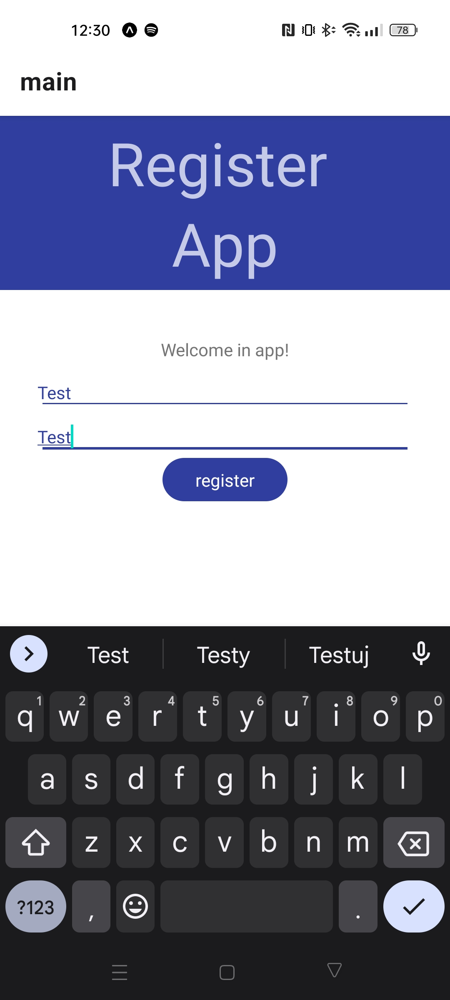
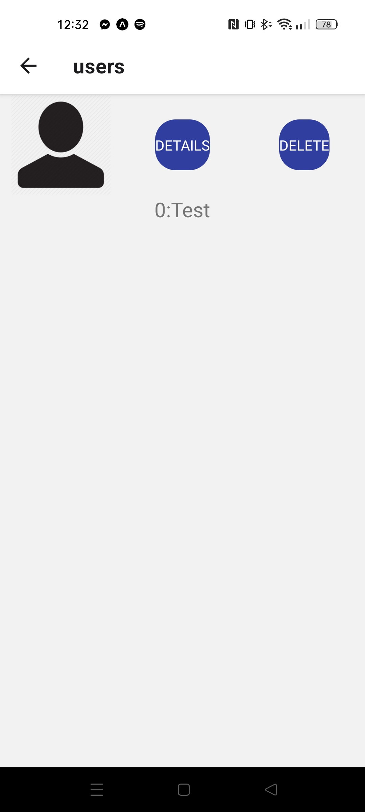
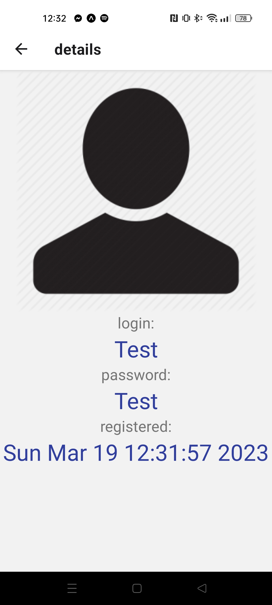
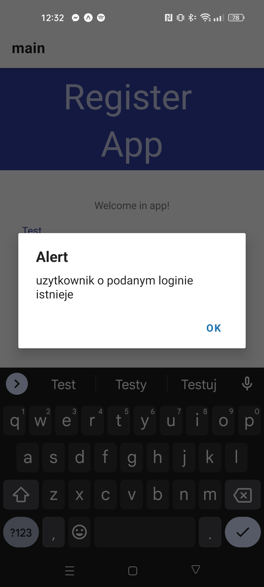

<h1>Register App</h1>

App was made in react native with using expo

<h2>What can we do in app?</h2>

<ul>
  <li>Register new user and save in local memory</li>
  <li>We can't create two users with the same login</li>
  <li>We can see list of created users</li>
  <li>We can see detail of selected user (login, password, date of registry)</li>
  <li>We can delete existing user</li>
</ul>

<h1>How to start register application?</h1>

Warning! Phone and computer must be in the same local network

Sometimes you need to disable firewall because it can block connection

<ol>
  <li>Make sure that you have installed git command line</li> 
  <li>Create empty folder</li>
  <li>Open new folder in cmd</li>
  <li>Write commands:
    <ol type="a" >
      <li><code>git init</code></li>
      <li><code>git pull https://github.com/szariii/react_native.git</code></li>
      <li><code>cd .\register_panel\server\</code></li>
      <li><code>npm start</code></li>
    </ol>
  </li>
      <li>Open folder in next cmd and write:
        <ol type="a" >
          <li><code>cd .\register_panel\react_native_register\</code></li>
          <li><code>npm install</code></li>
          <li><code>npm start</code></li>
        </ol>
      </li>
  <li>Install expo app on phone</li>
  <li>Scan QRCode which should show in cmd</li>
 </ol>

<h2>Screenshots</h2>

